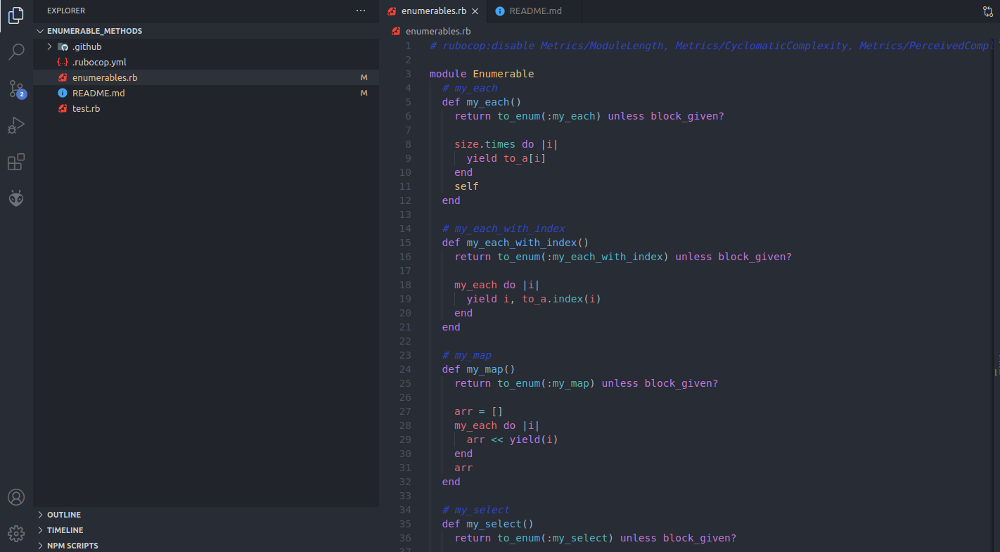

[](mailto:ahmt9417@gmail.com) [](https://twitter.com/ahmtbozaci)

# Enumerable-Methods



I rebuild Enumerable methods on the Ruby in this project. 

Functions:
1. my_each
2. my_each_with_index
3. my_map
4. my_select
5. my_any?
6. my_all?
7. my_none?
8. my_count
9. my_inject

## Live Code
[](https://repl.it/github/ahmetbozaci/Enumerable_Methods)

## Built With

- Ruby

## Getting Started

To get a local copy up and running follow these steps:

### Prerequisites

- Ruby installed on local machine
- Rspec installed on local machine
- A browser (for usage or repl.it)

### Usage

- Fork/Clone this project to your local machine
- Run ```rspec``` in the terminal of your root directory to run the described tests

## Author

👤 **Ahmet Bozaci**

- Github: [ahmetbozaci](https://github.com/ahmetbozaci)
- Twitter: [ahmtbozaci](https://twitter.com/ahmtbozaci)
- LinkedIn: [ahmetbozaci](https://www.linkedin.com/in/ahmetbozaci/)


## 🤝 Contributing

Contributions, issues and feature requests are welcome!

Feel free to check the [issues page](https://github.com/ahmetbozaci/Enumerable-Methods/issues)

Start by:

- Forking the project
- Cloning the project to your local machine
- `cd` into the project directory
- Run `git checkout -b your-branch-name`
- Make your contributions
- Push your branch up to your forked repository
- Open a Pull Request with a detailed description to the development(or master if not available) branch of the original project for a review

## Show your support

Give a ⭐️ if you like this project!

## Acknowledgments

- The Odin project for the project plan
- <https://ruby-doc.org/core-2.6.5/Enumerator.html>
- <https://ruby-doc.org/core-2.6.5/Enumerable.html>

## 📝 License

This project is [MIT](LICENSE.md) licensed
